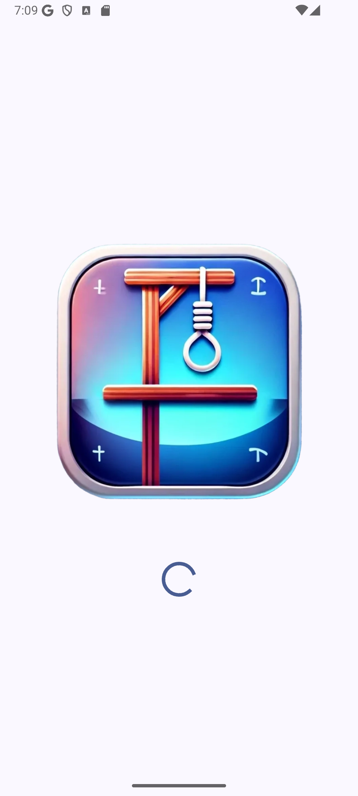
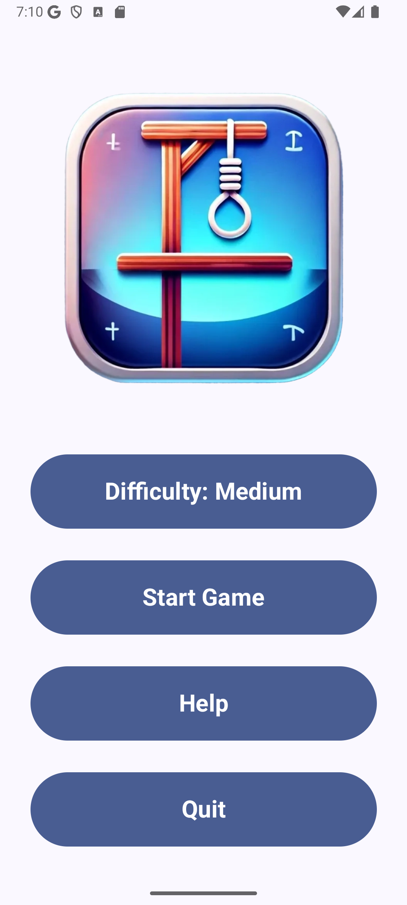
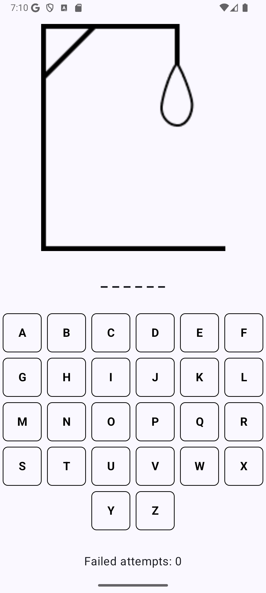
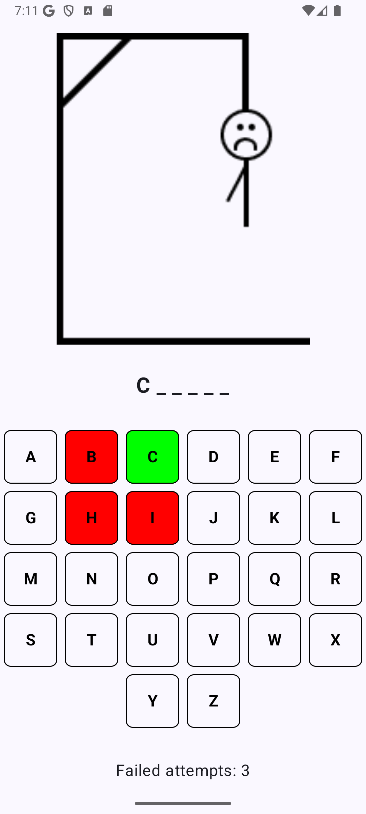
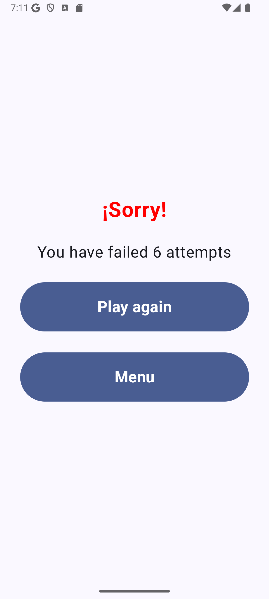
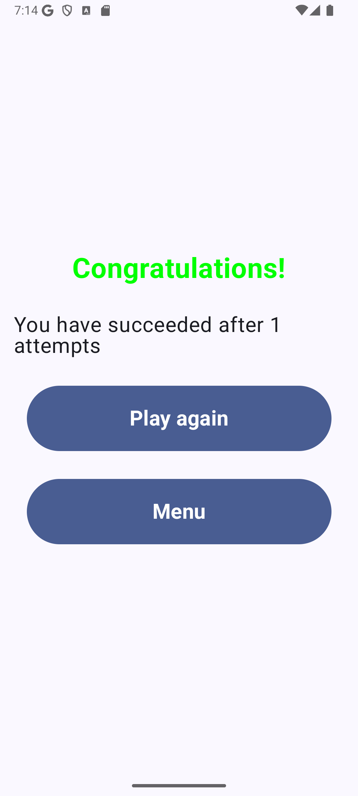

# Hangman App

## Descripción
Esta es una aplicación interactiva del clásico juego del **Ahorcado** desarrollado utilizando **Jetpack Compose** para la interfaz de usuario. El programa incluye distintas pantallas y funcionalidades que permiten a los usuarios seleccionar un nivel de dificultad, jugar el juego, y ver resultados tras cada partida. Está diseñado para proporcionar una experiencia fluida y dinámica.

---

## Funcionalidades principales

1. **Pantalla de carga (Splash Screen):**
   - Una pantalla inicial que muestra el logotipo del juego mientras se realiza la carga.
   - Se desactiva tras un breve periodo (2 segundos).   

   

2. **Menú principal:**
   - Los usuarios pueden seleccionar la dificultad del juego (Fácil, Media, Difícil).
   - Botones para iniciar el juego, ver ayuda o salir de la aplicación.   

   

3. **Juego:**
   - Visualización del gallo de ahorcado, la palabra a adivinar y un teclado interactivo para seleccionar letras.
   - Las letras seleccionadas se colorean en verde (correcto) o rojo (incorrecto).
   - Se muestra el número de intentos restantes.   

   

   

4. **Resultados:**
   - Pantalla de resultados que muestra si el jugador ganó o perdió.
   - Ofrece opciones para jugar de nuevo o regresar al menú principal.

   - Resultado negativo:   
     

   - Resultado positivo:   
     

---

## Características técnicas

### Modelo de datos
La lógica del juego está gestionada por la clase `GameViewModel` y utiliza un modelo de datos llamado `Game`. El modelo incluye:
- Palabra seleccionada.
- Letras adivinadas.
- Intentos restantes.
- Estado del juego (ganado o perdido).

### Dificultades
Se implementan tres niveles de dificultad:
- **Fácil:** Palabras simples como "dog" o "cat".
- **Media:** Palabras de dificultad media como "guitar" o "castle".
- **Difícil:** Palabras complejas como "pneumonia" o "onomatopoeia".

La selección de palabras se gestiona a través de la clase `Words`.

### Navegación
La aplicación utiliza navegación declarativa de Compose con rutas definidas en `Routes`:
- `Screen1`: Menú principal.
- `Screen2`: Pantalla del juego.
- `Screen3`: Pantalla de resultados.

### Interfaz de usuario
Utiliza componentes de Material Design 3 para los botones, menús desplegables y diálogos.
- Colores dinámicos para letras correctas/incorrectas.
- Animaciones simples para mejorar la experiencia del usuario.

---

## Cómo jugar
1. Selecciona una dificultad desde el menú principal.
2. Empieza el juego y selecciona letras para adivinar la palabra antes de que el gallo de ahorcado esté completo.
3. Al finalizar, revisa tu resultado y elige entre jugar nuevamente o regresar al menú principal.

---

## Requisitos
- **Kotlin**
- **Android Studio**
- SDK mínimo: 21
